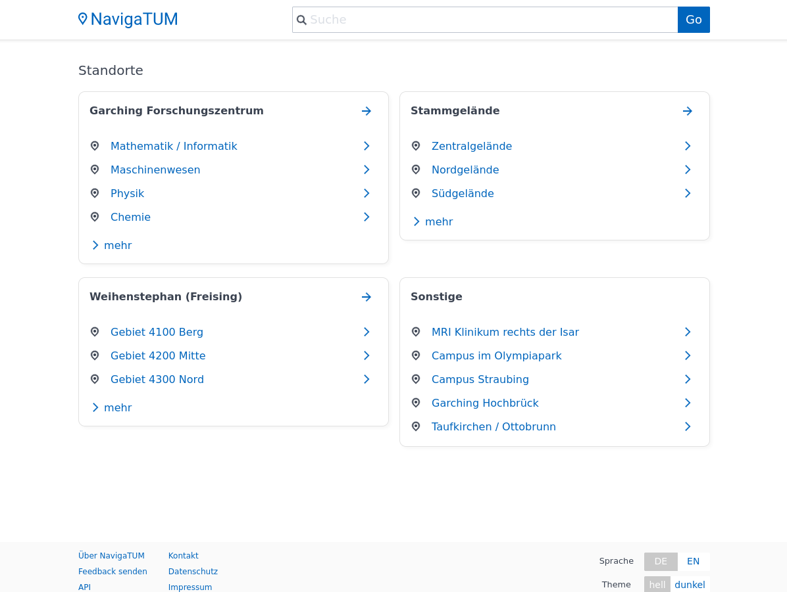
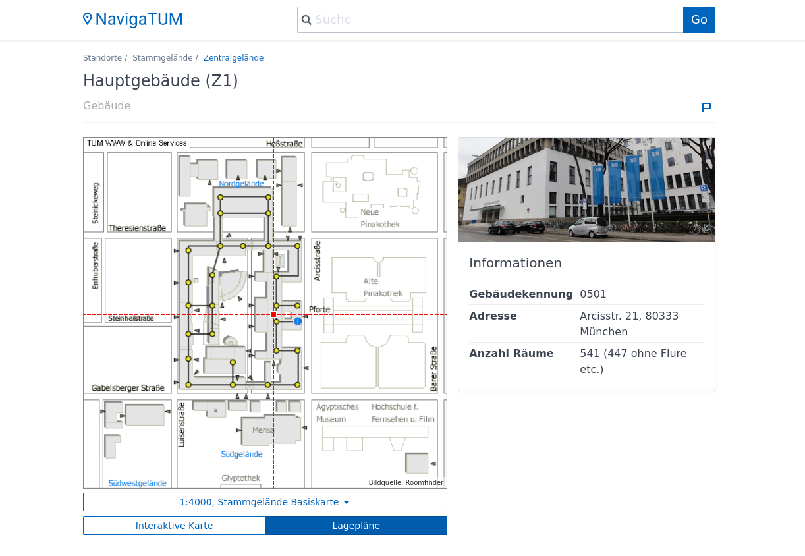
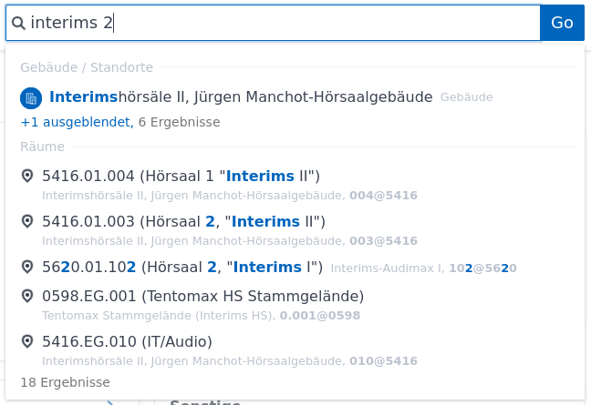

# NavigaTUM
NavigaTUM is a non-official tool developed by students for students, that aims to help you get around at [TUM](https://tum.de). Feel free to contribute.

Features:
- Interactive or RoomFinder-like maps to lookup the position of rooms or buildings
- Fast and typo-tolerant search
- Support for different room code formats as well as generic names

All functionality is also available via an API.

*Note: Not all buildings in NavigaTUM are owned by TUM, but are instead being used by TUM departments.*

## Screenshots
| | | |
|-|-|-|
||||

## Getting started
NavigaTUM consists of three parts + deployment resources.

- `data/` contains the code to obtain and process the data
- `server/` contains the API server written in Rust, including MeiliSearch as a search backend
- `webclient/` contains a JS based web-frontend for the API
- `deployment/` contains deployment related configuration

Depending on what you want to work on, you do not need to set up all of them.
The following steps assume you have just cloned the repository and are in the
root directory of it.

### Data
In case you do not want to work on the data processing, you can instead
download the latest compiled files:
```bash
wget -P data/output https://roomapi.tum.sexy/cdn/api_data.json 
wget -P data/output https://roomapi.tum.sexy/cdn/search_data.json
```

Else you can follow the steps in the [data documentation](data/).

### Server
Follow the steps in the [server documentation](server/).

### Webclient
Follow the steps in the [webclient documentation](webclient/).
If you want to soley run the webclient locally, you can skip the "Data" and
"Server" steps above and edit the webclient configuration to use the public
API as is described in the webclient documentation.

## License
All code is licensed under the GNU GPL v3:

This program is free software: you can redistribute it and/or modify
it under the terms of the GNU General Public License as published by
the Free Software Foundation, either version 3 of the License, or
(at your option) any later version.

This program is distributed in the hope that it will be useful,
but WITHOUT ANY WARRANTY; without even the implied warranty of
MERCHANTABILITY or FITNESS FOR A PARTICULAR PURPOSE.  See the
GNU General Public License for more details.

You should have received a copy of the GNU General Public License
along with this program.  If not, see https://www.gnu.org/licenses/.
