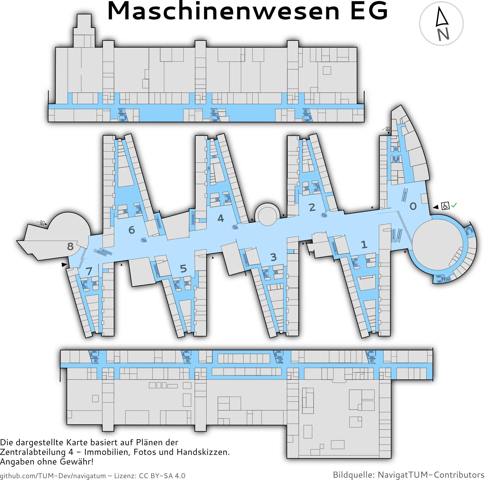

# NavigaTUM

NavigaTUM is a tool developed by students for students, to help you get around at [TUM](https://tum.de).
Feel free to contribute, we are open to new people 😄.

## Features/Roadmap

- [x] 🗺️ Interactive/static maps to look up the position of rooms or buildings
- [x] 🔍 Fast and typo-tolerant search
- [x] 💾 Support for different room code formats as well as generic names
- [x] 🤖 All functionality is also available via an open and well documented API
- [x] 🗘 Automatically update the data from upstream datasources
- [x] 🗨️ Allow students/staff to easily submit feedback and data patches
- [ ] 🏫 Generate maps from CAD data sources
- [ ] 🚶🏻 Generate turn by turn navigation advice for navigating end to end

If you'd like to help out or join us in this adventure, we would love to talk to you.

## Screenshots





## API Documentation and native clients

You can consume our API Documentation in two ways:

- Head over to [our Website](https://nav.tum.de/api) and look at the interactive documentation
- We also describe our API in an [OpenAPI 3.0](https://de.wikipedia.org/wiki/OpenAPI) compliant file.  
  You can find it [here](https://nav.tum.de/api/openapi.json).  
  Using this Specification you can generate your own client to access the API in the language of your choice.
  To do this head over to
  the [Swagger Editor](https://editor.swagger.io/?url=https://nav.tum.de/api/openapi.json)
  or other similar [OpenAPI tools](https://openapi.tools/).

> [!NOTE]
> The API is still under development, and we are open to Issues, Feature Requests or Pull Requests.

## Getting started

### Overview

NavigaTUM consists of three main parts + deployment resources.

Depending on what you want to work on, you **do not need to set up all of them**.

- `data/` contains the code to obtain and process the data
- `server/` contains the APIs written in Rust
- `webclient/` contains a JS based web-frontend for the API
- `map/` contains information about our own map, how to style it and how to run it
- `DEPLOYMENT.md` contains deployment related documentation

Let's go through them one by one, but first, you need to clone the repository:

```bash
git clone https://github.com/TUM-Dev/Navigatum.git
cd Navigatum
```

### Data Processing

In case you do not want to work on the data processing, you can instead
download the latest compiled files by running the server.

Otherwise, you can follow the steps in the [data documentation](data/README.md).

### Webclient

Follow the steps in the [webclient documentation](webclient/README.md).
If you want to only run the webclient locally, you can skip the "Data" and "Server" sections or use docker to run a
close-to-production version

By default, the webclient will use the public API.
If you want to use a local version, you can use docker to run a close-to-production version.

Further details on our frontend can be found in the [webclient documentation](webclient/README.md).

### Server

To build the server locally, you can run the following command:

```bash
docker compose -f docker-compose.local.yml up --build
```

The API will be available at [`http://localhost:3003`](http://localhost:3003) and the frontend at [
`http://localhost:3000`](http://localhost:3000).

> [!NOTE]
> We also need to run an incremental compilation for our server.
> The first compilation will be slow, afterward this will only take a bit of time.
> The local builds also run in `PROFILE=debug` to improve build-times.
>
> Not beating around the bush:
> Compilation times for the [`server`](./server) are a problem, but we are confident that
> these can be resolved via upstream language improvements such as
> [polonius](https://blog.rust-lang.org/inside-rust/2023/10/06/polonius-update.html), [cranelift](https://github.com/rust-lang/rustc_codegen_cranelift), [paralell-frontend](https://blog.rust-lang.org/2023/11/09/parallel-rustc.html),....


> [!NOTE]
> The **local** build will not deploy a full stack and **skips all geodata**.
> As such, the following services are not deployed as their initialisation work is heavy and likely not relevant:
> - [valhalla](https://github.com/valhalla/valhalla) (a routing service),
> - [nominatim](https://nominatim.org/) (for address geocoding)
> - [planetiler](https://github.com/onthegomap/planetiler) (for generating basemap tiles database of our tileserver)
> - [martin](https://github.com/maplibre/martin) (as it would not have any data to pull on)

Further details on our backend can be found in the [server documentation](server/README.md).

### Formatting

We have multiple programming languages in this repository, and we use different tools to format them.

since we use [pre-commit](https://pre-commit.com/) to format our code, you can install it in an virtual environment
with:

```bash
python3 -m venv venv
source venv/bin/activate
pip install -r data/requirements.txt -r server/test/requirements.txt -r requirements-dev.txt # for mypy the server and data requirements are needed
```

To format all files, run the following command:

```bash
pre-commit run --all-files
```

You can also automatically **format files on every commit** by running the following command:

```bash
pre-commit install
```
