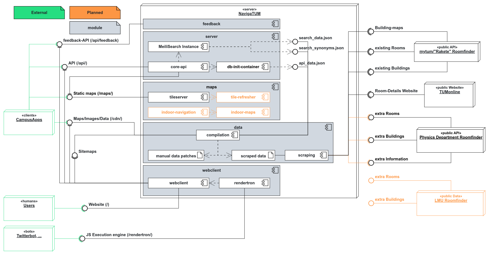

# Deployment

This Project details how to deploy NavigaTUM
The documentation for the specific sub-services can be found in the respective directories:

- [Data](../data/README.md)
- [Backend-Server](../server/README.md)
- [Website](../webclient/README.md)
- [Maps](../map/README.md)

## General description

The current physical infrastructure is as follows:

```
         public                         admins                     devs on github      
                                                                                       
           │                               │                            │
           ▼                               ▼                            ▼              
┌───────────────────────┐   ┌──────────────────────────┐   ┌──────────────────────────┐
│                       │   │                          │   │                          │
│  tumzitm-navigatum-1  │   │     tumzitm-navigatum-2  │   │   tumzitm-navigatum-3    │
│                       │   │                          │   │                          │
└──────────┬────────────┘   └──────────────▲───────────┘   └────────────┬─────────────┘
           │                               │                            │             
           └─────────────►─────────────────┴──────────────◄─────────────┘              
                                       metrics, logs                                   
```

On each of the servers we run a docker cluster configured via ansible.
The deployment script is located at `TUM-Dev/d9s`.
We intentionally are not running kubernetes, as we never need to scale above 0.1 CPUs in active deployment.
We are confindent that even if we were to add more universitys, more load would not exceed the capacity of one server.

On every of these nodes we run the following supporting services:

- [traefik](https://traefik.io/) as a reverse proxy
- [`prometeus`](https://prometheus.io/), [`alertmanager`](https://prometheus.io/docs/alerting/latest/alertmanager/), [`loki`](https://grafana.com/),
  and [`grafana`](https://grafana.com/),  [uptime-kuma](https://github.com/louislam/uptime-kuma) for monitoring purposes
- [watchtower](https://containrrr.dev/watchtower/) to update our deployments

We run the following components at these paths:

- `/` [webclient](../webclient) written in [`Vue`]/[`nuxt-4`](https://nuxt.dev)
- `/api/` [server](../server) written in [`Rust`](https://nuxt.dev)/[`actix-web`](https://nuxt.dev)
- `/tiles/` [`marvin`] tiles from OSM
- `/map/` [`tileserver-gl`] rendering tiles from OSM
  slated to be removed in favor of `/tiles/`
- `/cdn` nginx server serving the static files we need
  slated to be folded into the `server`-startup

The project is layed out in this sense:  

