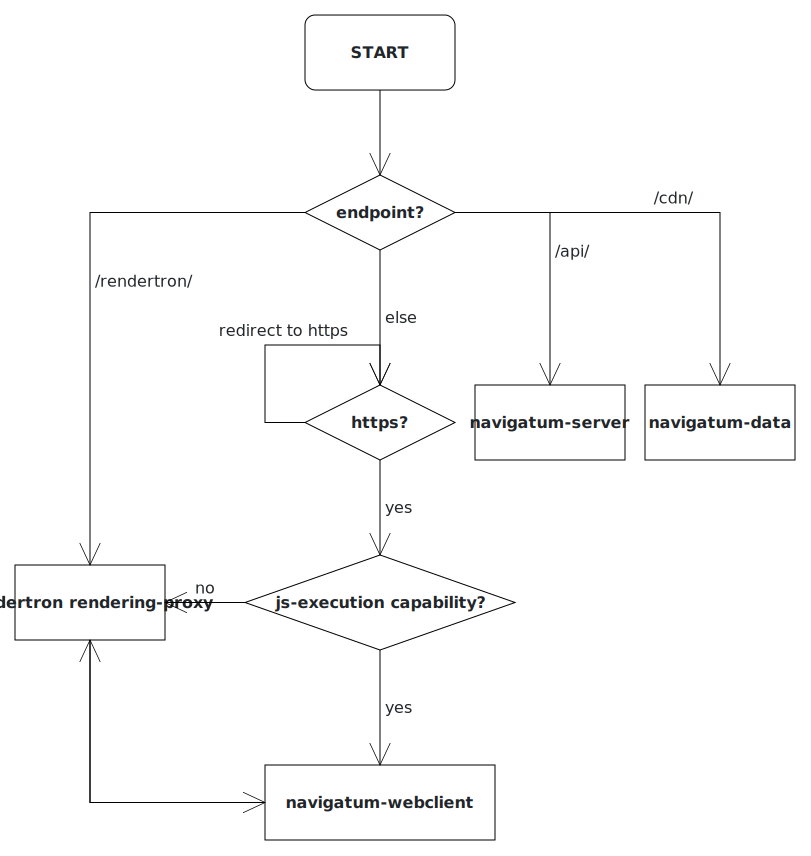
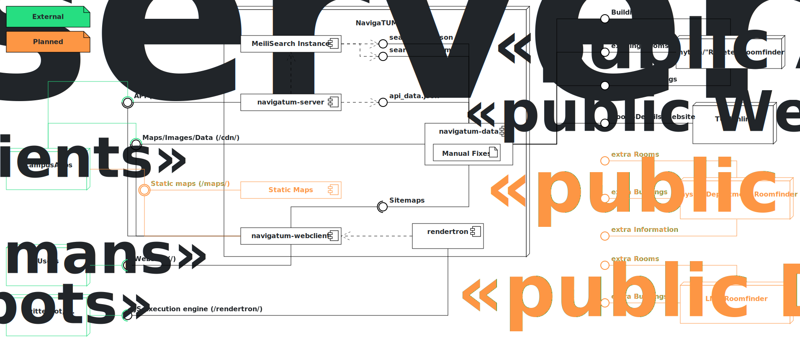

# NavigaTUM-deployment

This Project details how to deploy the NavigaTUM-API, the webclient and the CDN

The documentation for the specific sub-services can be found in the respective directories:

- [Data](../data/README.md)
- [API/Server](../server/README.md)
- [Website](../webclient/README.md)

## General description

The general request-Flowchart is the following:  

The project is layed out in this sense:  

Genreral information:

- For the deployments we use [containerd](https://containerd.io/) and [k3s](https://k3s.io/).
- Deployments are automatically done via [argocd](https://argo-cd.readthedocs.io/).
- Inside k3s [traefik](https://traefik.io/) redirects the requests to the correct container.
- The https-certificate is provided by [Let's Encrypt](https://letsencrypt.org/) and managed by [cert-manager](https://cert-manager.io/).
- we use [prometeus](https://prometheus.io/) and [allertmanager](https://prometheus.io/docs/alerting/latest/alertmanager/) for monitoring purposes.
