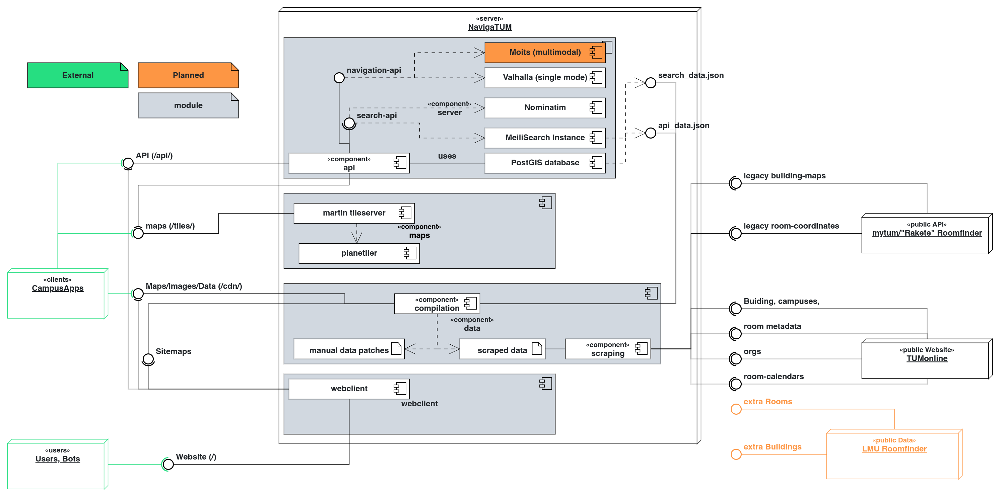

# Deployment

This Project details how to deploy NavigaTUM
The documentation for the specific sub-services can be found in the respective directories:

- [Data](../data/README.md)
- Backend-Servers
  - [API Server](../server/main-api/README.md)
  - [Feedback](../server/feedback/README.md)
  - [Calendar](../server/calendar/README.md)
- [Website](../webclient/README.md)
- [Maps](../map/README.md)

## General description

The current physical infrastructure is as follows:


On each of the servers we run a k3s cluster in a High-Availability-Deployment with embedded etcd as a Datastore.
The k3s cluster is managed by ansible.
The ansible playbook is located in `deployment/ansible/` and is called `site.yml`.

On every of these nodes we run the following supporting services:

- [traefik](https://traefik.io/) as a reverse proxy
- [cert-manager](https://cert-manager.io/) to manage the https-certificate via [Let's Encrypt](https://letsencrypt.org/)
- [prometeus](https://prometheus.io/), [allertmanager](https://prometheus.io/docs/alerting/latest/alertmanager/)
  and [grafana](https://grafana.com/) for monitoring purposes
- [argocd](https://argo-cd.readthedocs.io/) to manage the deployments
- [uptime-kuma](https://github.com/louislam/uptime-kuma) to monitor the uptime of the services

The general request-Flowchart is the following:  


The project is layed out in this sense:  


### Environment Based Deployment

We have two different kinds of environments:

- staging
- production

The differences between the two is, that production has some extra secrets and more resource allocation.
Namely:

- we don't publish our `GITHUB_TOKEN` to git. (used to pass feedback from the webclient to github)
- we don't publish the `JWT_KEY` to git. (used to generate tokens to ratelimt feedback creation)
- we don't publish the `MEILI_MASTER_KEY` to git. (used as aditional layer of network hardening between the webclient
  and the server)
- we don't publish the `CONNECTUM_OAUTH_CLIENT_{SECRET,ID}` to git. (used to connect to the calendar and possibly
  further apis in the future)

Deployment happen automatically on push to main, or on push to a PR.
For PRs we only execute this deployment request, if the autor is a member of the `@TUM-Dev/navigatum`-group or a member
authorises this PR to run actions.
The reasoning is, that we don't want strangers to be able to fork our project, change the deployment to something
malicious and make us deploy it.

### ansible

We use [ansible](https://www.ansible.com/) to deploy the k3s cluster.
As an additional dependency you need to `ansible-galaxy collection install kubernetes.core`

The ansible playbook is located in `deployment/ansible/` and is called `site.yml`.

It is split into these roles:

- `common` which sets up a basic linux system with basic hardening
- `k8s` which deploys the HA-k3s cluster
- `k8s-components` which deploys the supporting infrastructure components in kubernetes

The whole playbook is idempotent, so you can run it multiple times without any problems.
To run it, you need can execute the following command:

```bash
ansible-playbook -i deployment/ansible/hosts.ini -k deployment/ansible/site.yml
```
