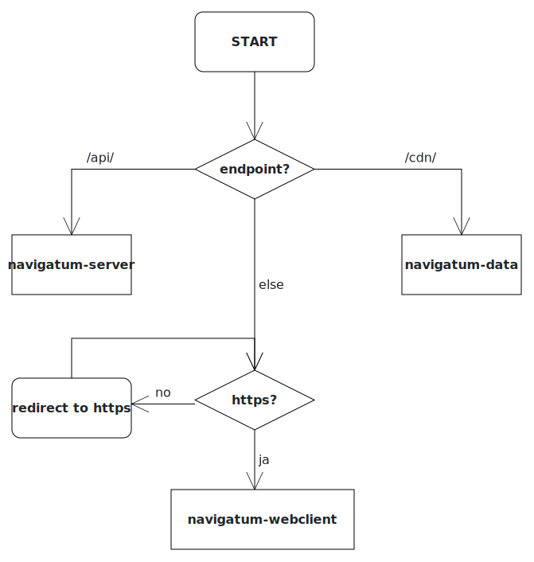

# navigatum-deployment

This Project details how to deploy the navigatum-API, the webclient and the CDN

The documentation for the spectific sub-services can be found in the respective repos:

- Issues: <https://git.fs.tum.de/navigatum/navigatum-issues>
- Data: <https://git.fs.tum.de/navigatum/navigatum-data>
- API/Server: <https://git.fs.tum.de/navigatum/navigatum-server>
- Website: <https://git.fs.tum.de/navigatum/navigatum-webclient>

## General description

The general request-flowpath is the following:  
  
  
The project is layed out in this sense:  
  
  
Genreral information:

- For the deployments we use docker and [k3s](https://k3s.io/).
- Deployments are automatically done via [argocd](https://argo-cd.readthedocs.io/).
- Inside k3s [traefik](https://traefik.io/) redirects the requests to the correct container.
- The https-certificate is provided by Let's Encrypt and managed by [cert-manager](https://cert-manager.io/).
- we use prometeus and allertmanager for monitoring purposes.
